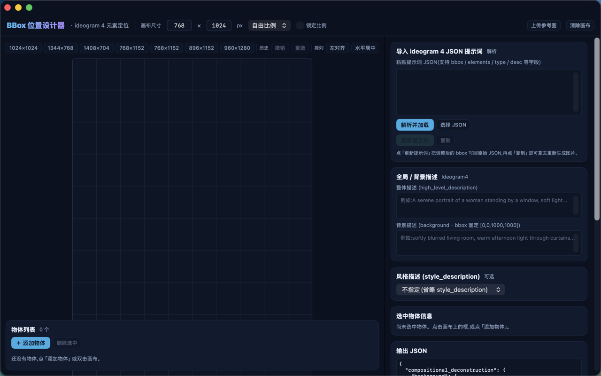

# BBoxDesigner

> BBox 位置设计器 · Ideogram 4 元素定位 — macOS 原生 SwiftUI 版



在画布上拖动物体框 → 自动生成 bbox 坐标与描述 → 输出符合 Ideogram 4 caption schema 的结构化 JSON 提示词,并可一键调用本地 FLUX.2-klein(MCP)直接生成图片验证布局。

这是网页工具 **[BBox 位置设计器](https://bbox.toolbuddy.art/)** 的 SwiftUI 复刻版(详见文末 [Acknowledgments](#acknowledgments))。

## 功能

- **画布**:7 档尺寸预设(1024²/1344×768/1408×704/768×1024/768×1152/896×1152/960×1280)、自定义 W×H(64 对齐)、9 种比例锁定、参考图(上传 / 拖拽 / ⌘⇧V 粘贴)
- **框编辑**:拖动移动、8 手柄缩放、双击空白新建、框选 / ⌘加选 / Shift 范围选、多选整体拖动(组包围盒统一钳制贴边不变形 + 虚线组框)、6 向对齐、双向等距、复制 / 锁定 / 隐藏、网格吸附、智能对齐吸附(画布/物体边缘与中线,黄色参考线 + 触摸板触觉反馈,⌘ 拖动临时禁用)、三分构图参考线
- **快捷键**:⌘Z / ⇧⌘Z 撤销重做、Delete 删除、⌘A 全选、方向键微调(Shift = 20px 大步进)、⌥B 底图显隐
- **导入**:粘贴 / 选文件解析 Ideogram 4 JSON(bbox 轴序 `[ymin,xmin,ymax,xmax]` @0–1000;兼容 `elements` / `compositional_deconstruction.elements` / `objects` / `boxes`;字段别名 desc/description/label/name)
- **写回**:「更新提示词」带差异确认面板(BBox / 描述 / 全局字段 / 新增 / 删除),原地更新——**保留未知字段与键顺序**(自研保序 JSON AST `JVal`)
- **输出**:实时 caption JSON(`high_level_description` + `style_description` + `compositional_deconstruction`),标量数组单行紧凑格式;复制 caption / 复制为提示词
- **色板**:对象级 `color_palette` + desc 内 `#rrggbb` 提取,单击复制、双击改色(24 预设色 + hex + 系统取色器)
- **配置管理**:保存 / 还原 / 删除,持久化到 `~/Library/Application Support/BBoxDesigner/configs.json`(含背景图)
- **AI 自动标注**:左侧「✨ AI 自动标注」面板,拖图 → Ollama 视觉模型实体清点 → ComfyUI SAM3 批量定位 → NMS/折叠后一键进画布(SAM3 离线自动降级为「仅清单无 bbox」,不阻塞);详见下文
- **本地生成**:集成 flux-klein MCP,从画布拍平提示词 → `generate_image`,结果可自动设为参考图

## 构建与运行

无需 Xcode,只需 macOS Command Line Tools(Swift 5.9+ / macOS 14+):

```bash
scripts/make_app.sh        # swift build -c release + 打包 BBoxDesigner.app(并同步覆盖 ~/Desktop/BBoxDesigner.app)
open BBoxDesigner.app
```

自测与冒烟:

```bash
BBoxDesigner.app/Contents/MacOS/BBoxDesigner --selftest   # 178 项断言:JSON 解析/写回闭环 + 吸附/多选/标签 + AI 标注(M1–M5)
BBoxDesigner.app/Contents/MacOS/BBoxDesigner --mcptest    # flux-klein MCP 握手冒烟测试
BBoxDesigner.app/Contents/MacOS/BBoxDesigner --annotate-smoke <图片> [模型]   # AI 自动标注端到端冒烟(M1→M3→M4)
```

## AI 自动标注(Ollama + ComfyUI SAM3,可选)

左侧工具栏「✨ AI 自动标注」面板:拖入/粘贴图片 → 实体识别 → 批量定位 → 进画布,全流程网络调用均为 async/await,UI 不阻塞。

- **实体识别(M1)**:本地 Ollama 视觉模型(默认 `http://127.0.0.1:11434`,`POST /api/chat`,`format:json`),系统提示词穷尽 7 层(人物/服装逐部件/五官/头发/手手臂/场景道具/自然元素),JSONDecode 失败自动重试 1 次;**模型下拉**启动时读 `ollama list` 自动填充,默认模型见 `docs/ai-annotate-m0-report.md`
- **分辨率自适应(M2)**:按输入图宽高比匹配最近画布预设并锁定比例;坐标换算 SAM3 像素 bbox ↔ Ideogram 轴序 `[ymin,xmin,ymax,xmax]` @0–1000(往返误差 ≤1/1000)
- **SAM3 批量定位(M3)**:ComfyUI(`http://127.0.0.1:8188`)+ SAM3 节点与 `sam3.1_multiplex_fp16.safetensors` 权重;全部 label 单次 `/prompt` 批量提交,低置信度(<0.4)/缺失实体单独重试(并发限流 4、单实体 60s 超时、同义词回退);**降级行为**:`/system_stats` 不可达时自动降级为「仅清单无 bbox」,清单仍可导入画布,不阻塞管线
- **后处理(M4)**:纯程序化 NMS(同类 IoU>0.85 保大框)、极小框过滤(<0.1% 画布)、嵌套框保留、person 在前按面积降序;「复制为提示词」走生成视图折叠(部件并入父级,输出 3–6 个不重叠主元素),画布始终保留全量标注
- **底面背景(M5)**:导入图片自动设为画布底图(叠图对照微调),透明度 **30%/60%/100% 三档**,**⌥B** 一键隐藏/恢复;状态持久化到 configs.json

## MCP 集成(可选)

App 以子进程方式启动本机 `~/Desktop/FluxKleinStudio.app/Contents/MacOS/FluxKleinStudio mcp`(行分隔 JSON-RPC 2.0 over stdio),调用 `generate_image`:

- 画布尺寸自动对齐到 16 倍数(256–2048)作为生成分辨率
- 输出到 `~/Library/Application Support/BBoxDesigner/outputs/`
- 若未安装 [flux-klein-studio](https://github.com/) MCP 二进制,生成面板显示不可用,其余功能不受影响

## 项目结构

```
Sources/BBoxDesigner/
├── JVal.swift         # 保序 JSON AST + 解析器 + 紧凑序列化(复刻网页 stringifyCompact)
├── EditorState.swift  # 画布模型 / 解析 / 写回 / 撤销重做 / 配置持久化
├── CanvasView.swift   # 画布渲染与手势(移动/缩放/框选/双击新建)
├── Panels.swift       # 物体列表 / 选中信息 / 全局风格 / 导入 / 输出 / 配置 / 生成 / AI 标注面板
├── ContentView.swift  # 主界面布局 / 快捷键 / 差异确认面板
├── FluxMCP.swift      # stdio MCP 客户端 + FLUX 生成状态
└── SelfTest.swift     # --selftest 自测
Sources/AIAnnotate/
├── OllamaVision.swift     # M1:Ollama 视觉实体识别(HTTP 客户端 + JSON 容错)
├── AutoResolution.swift   # M2:分辨率自适应 + 坐标轴序换算(纯函数)
├── SAM3Grounder.swift     # M3:ComfyUI SAM3 批量定位 + 离线降级
└── AnnotatePipeline.swift # M4:NMS/折叠后处理 + caption 组装 + --annotate-smoke
```

## configs.json 格式

`~/Library/Application Support/BBoxDesigner/configs.json` 自 M5 起为新格式(保序 JVal 写出):

```json
{"settings": {"bg_visible": true, "bg_opacity": 0.6}, "configs": [ …命名配置… ]}
```

- `settings`:全局设置位(底图显隐 `bg_visible`、底图透明度 `bg_opacity`,三档 0.3/0.6/1.0)
- `configs`:命名配置数组(同旧格式元素结构,含背景图 base64)
- **旧格式兼容**:直接是裸 `[SavedConfig]` 数组的 configs.json 仍可正常读取,设置位给默认值(visible=true、opacity=60%),下次写入自动升级为带 `settings` 的新格式

## Acknowledgments

- 本项目的设计与交互复刻自 **[@ToolBuddy 的 BBox 位置设计器](https://bbox.toolbuddy.art/)**(ideogram 4 元素定位网页工具)。原站点为闭源单页应用;我们检索了 GitHub(toolbuddy-io 组织、"ideogram bbox"、特征代码串等),**截至 2026-09 未找到其公开源码仓库**,故无法 fork,本仓库为独立的净室(clean-room)SwiftUI 重实现。若原作者公开仓库,欢迎联系,我们乐意改为 fork 关系并补充署名链接。
- bbox 轴序 `[ymin,xmin,ymax,xmax]` @0–1000 等 caption schema 约定来自 [Ideogram 4](https://github.com/ideogram-oss/ideogram4)。
- 本地文生图由 [FLUX.2-klein](https://huggingface.co/black-forest-labs) (MLX / mflux) 驱动。

## License

[MIT](LICENSE) © 2026 Jup33Q
